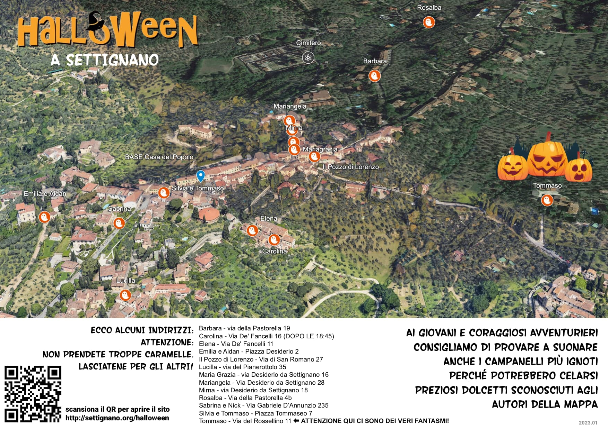

# Halloween a Settignano

## Mercoledì 30
Dalle 14:30 alle 16:30 i bambini possono venire alla Casa del Popolo portando la propria zucca, attrezzi (coltello e cucchiaio minimo) e decori, e lavoreranno INSIEME AI PROPRI GENITORI O DELEGATI alla propria opera che poi porteranno a casa o lasceranno in esposizione per il giorno dopo.
NECESSARIO PRENOTARSI ENTRO DOMENICA 27 al bar o 055697007

## Giovedì 30

- dalle 16:30 alle 17:30 ritrovo alla Casa del Popolo per merenda e vestizione (ognuno si porta i suoi vestiti e si veste)
- dalle 17:30 alle 19:30 tutti in giro per Settignano (accompagnati dai propri genitori, ovviamente)

NB: non c'è nessuna attività pre-organizzata: ogni genitore deve tutelare i propri figli eventualmente in coordinazione con altri amci di classe. Noi si è fatto giusto un lavoro di preparazione e avviso.

## Abitanti di Settignano:
Fate sapere di essere pronti a regalare una caramella ai bambini che vagheranno per il paese. Mettete una candela accesa, o un disegno di una zucca, questo volantino o altro sulla vostra porta o citofono.

## Mappa
questa è la mappa del 2023 (anno scorso)... vediamo se l'aggiorniamo ma altrimenti andate in giro... sopratutto da Tommaso!!

